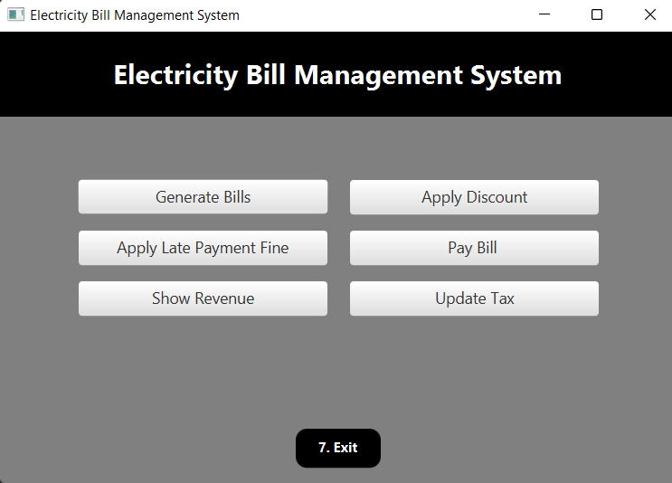
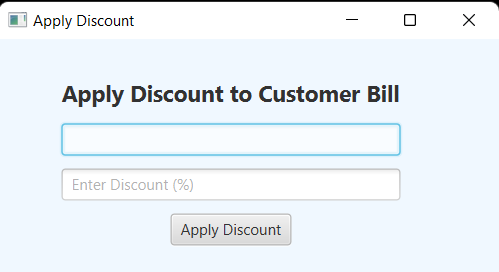
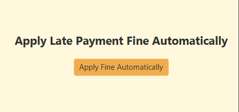
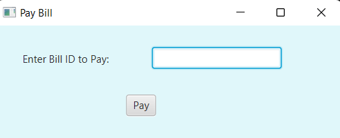
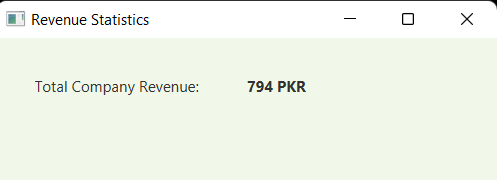

# Welcome to Electricity Bill Management System
The Electricity Bill Management System is a JavaFX-based application designed to 
simplify and automate electricity billing operations. It allows users to generate
bills using consumer details and meter readings, apply dynamic discounts, fines 
for late payments and adjustable tax rates and update the payment status of each
bill. All billing data is stored in a structured file, making it lightweight and 
easy to manage. The system includes separate Java classes such as Payment, 
Discount and Fine, each following Object-Oriented Programming (OOP) principles to
ensure modularity and maintainability. The user interface is built with JavaFX 
components like ComboBoxes, TextFields and Buttons which provides an intuitive 
and interactive experience for managing billing records and viewing revenue 
updates efficiently.

## Features
- Bill generation using user CNIC, name, address, category and meter readings.
- Dynamic application of discounts, fines (for late payments), and customizable tax rates.
- Payment status update functionality with real-time revenue calculation.
- JavaFX-based responsive user interface with ComboBoxes, TextFields, and Buttons.
- Modular OOP structure with separate classes (Payment, Discount, Fine) for clean logic separation.
- Scalable and maintainable codebase suitable for academic or lightweight commercial use.


## Screenshots

**Main Menu**:


**Generate Bill Page**:


**Discount Page**:


**Fine Page**:


**Pay Bill Page**:


**Revenue Page**:


**Update Taxes Page**:
")

## Project Structure
```
 ElectrictyBillManagementSystem/            (This is your main project root)
    ├── .idea/                                 (Module-specific IntelliJ configuration)
    │  
    ├── src/                                   (Source code folder)
    │   ├── main/                              (Main source code and resources)
    │   │   ├── java/
    │   │   │   └── com/
    │   │   │       └── example/
    │   │   │           └── demo4/
    │   │   │               ├── ApplyDiscountController.java
    │   │   │               ├── ApplyLateFineController.java
    │   │   │               ├── CallGenerateBill.java
    │   │   │               ├── Category.java
    │   │   │               ├── Discount.java
    │   │   │               ├── ElectricityBillSystem.java
    │   │   │               ├── Fine.java
    │   │   │               ├── GenerateBill.java
    │   │   │               ├── GenerateBillController.java
    │   │   │               ├── HelloApplication.java
    │   │   │               ├── HelloController.java
    │   │   │               ├── PayBillController.java
    │   │   │               ├── Payment.java
    │   │   │               ├── RevenueStatisticsController.java
    │   │   │               ├── Taxes.java
    │   │   │               └── TaxesController.java
    │   │   └── module-info.java
    │   │
    │   └── resources/                         (FXML and other resources)
    │
    ├── screenshots/                           (Your screenshots folder)
    ├── Readme.md                              (Your main Readme file)
    ├── .gitignore                             (Git ignore file for project)
    ├── mvnw                                   (Maven Wrapper script for Linux/macOS)
    ├── mvnw.cmd                               (Maven Wrapper script for Windows)
    └── pom.xml                                (Maven Project Object Model file)
 ```

## Technologies Used
- **Language**: Java 17
- **Framework**: JavaFX
- **Styling**: JavaFX
- **Build Tool**: Maven
- **OOP Concepts**: Encapsulation, Association, Inheritance, Enumeration

## Contributing
I welcome contributions to enhance Electrity Bill Management System. Here's how you can help:
1. Fork the repository.
2. Create a new branch (`git checkout -b feature/your-feature`).
3. Make your changes and commit them (`git commit -m "Add your message"`).
4. Push to the branch (`git push origin feature/your-feature`).
5. Open a Pull Request with a description of your changes.

Please ensure your code follows the existing style.

## Contact
- **Author**: Najmul Arifeen
- **GitHub**: [https://github.com/najmularifeen](https://github.com/najmularifeen)